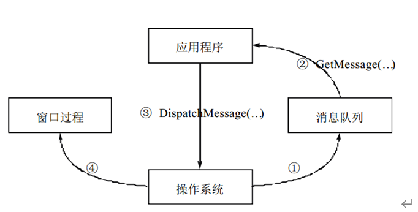
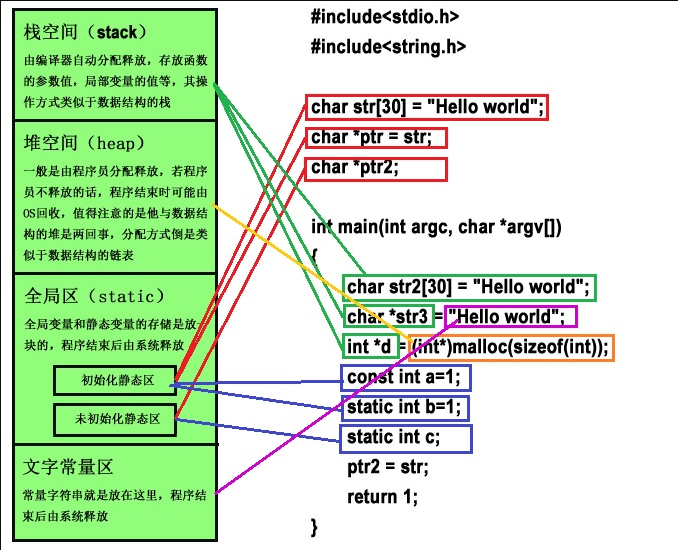
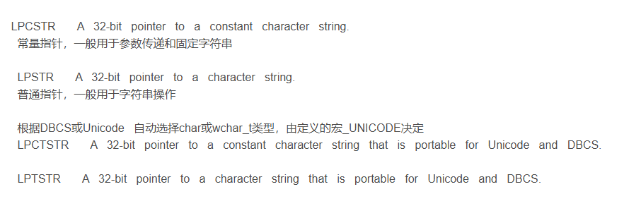
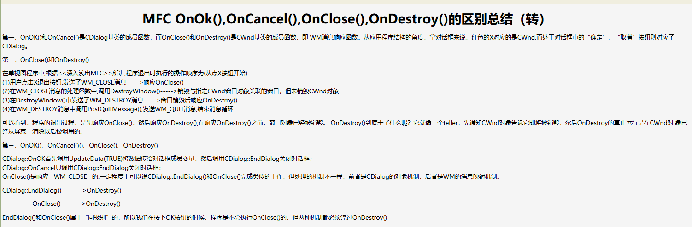
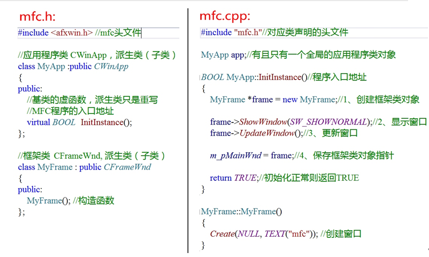
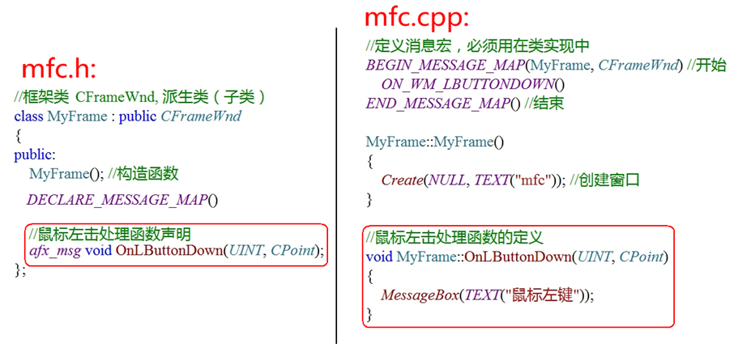

# MFC

## 1. Windows消息机制

- windows识别的主函数入口是WinMain函数
- 消息机制图



- Win32程序需要加头文件`#include<windows.h>`
- 主要的步骤是：
1. WinMain函数的定义
2. 创建窗口
3. 消息循环
4. 编写窗口过程函数

```C
//1.设计窗口
//2.注册窗口(类)
//3.创建窗口
//4.显示和更新
//5.通过循环取消息
//6.处理消息（窗口过程）
```

## 2. 注意事项

### 2.1 多字节与宽字节

- 一个字符对应一个字节->多字节 ASCII
- 一个字符对应多个字节->宽字节 Unicode
- 多字节转为宽字节：L“aaa”
- 自动实现自适应字节转换：TEXT(“aaa”)， 类似的，TCHAR也能实现自适应编码的转换

- 统计字符串（多字节）长度：
``` C
char *p = "aaa";
int num = strlen(p);
```

- 统计字符串（宽字节）长度：
```C
char *p = L"aaa";
int num = wcslen(p);
```

- char* 与CString的转换
```C
//char* -> CString
char * p = "aaa";
CString str = CString(p);

//CString-> char*
CStringA tmp = str;
char *p = tmp.GetBuffer();
```
- C++中的String与MFC中的CString不能直接转换，只能通过char* 来过度转换







- 用基类的OnOK()函数，执行基类中的EndDialog(IDOK)函数，作用是关闭对话框，并把IDOK作为对话框的返回值，返回给调用对话（DoModal）的地方。

## 3. MFC

### 3.1 基础知识

- 文档介绍：MFC基础教程
- 微软基础类库：Microsoft Foundation Classes
- 编写MFC程序需要包含`#include<afxwin.h>`
- 类库中文手册：VC++之MFC类库中文手册

### 3.2 MFC窗口创建



### 3.3 消息映射机制

- 消息映射是一个将消息和成员函数相互关联的表。
- 框架窗口接收到一个鼠标左击消息，MFC将搜索这个窗口的消息映射，如果存在一个处理`WM_LBUTTONDOWN`的处理程序，那么就调用`OnLButtonDown`。
- 将消息映射添加到一个类中所做的工作：

1. 在所操作的类中声明消息映射宏。
2. 通过放置标识消息的宏来执行消息映射，相应的类将在对BEGIN_MESSAGE_MAP和END_MESSAGE_MAP的调用之间处理消息。
3. 对应消息处理函数分别在类中声明，类外定义：



### 3.4 向导式MFC

生成的MFC项目共有4个类：
1. App(一般不用写)
2. View(展示)
3. Frame(逻辑)
4. Doc(数据文档)

- 数据的存储和加载由文档类来完成，数据的显示和修改则由视类来完成。
- 通过修改传递给PreCreateWindow的结构体类型参数CREATESTRUCT，应用程序可以更改用于创建窗口的属性。在产生窗口之前让程序员有机会修改窗口的外观。
- OnCreate是一个消息响应函数，是响应WM_CREATE消息的一个函数，而WM_CREATE消息是由Create函数调用的。一个窗口创建（Create）之后，会向操作系统发送WM_CREATE消息，OnCreate()函数主要是用来响应此消息的。

- MFC中后缀名为Ex的函数都是扩展函数。
- 在MFC中，以Afx为前缀的函数都是全局函数，可以在程序的任何地方调用它们。
