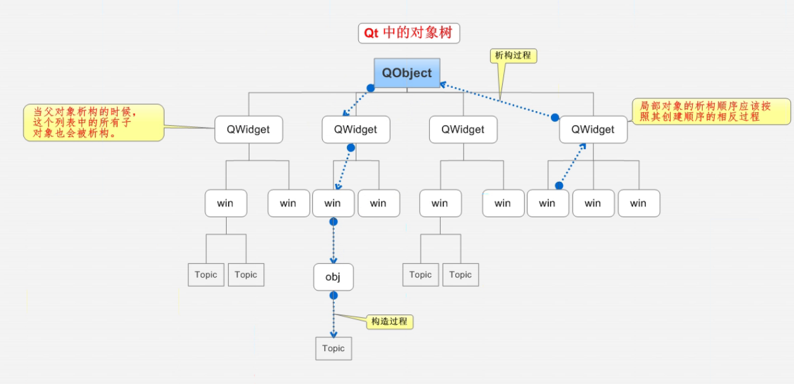
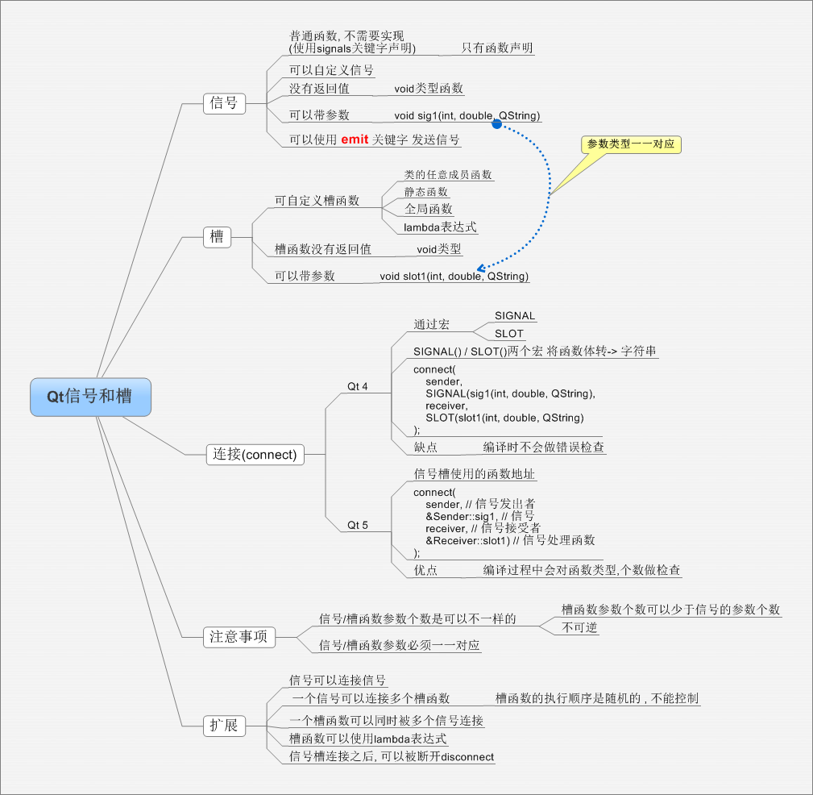
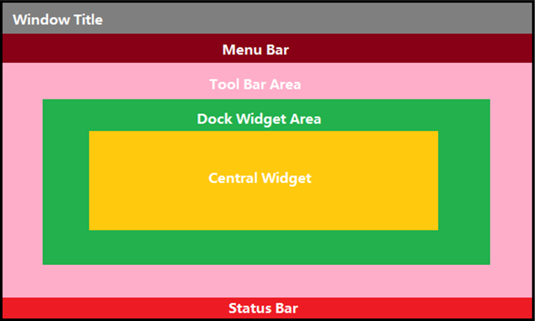
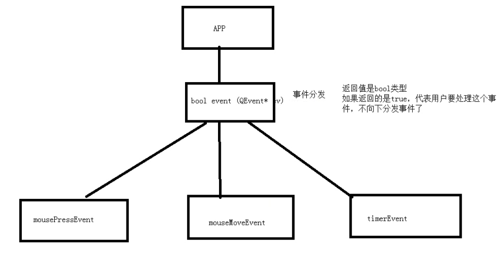
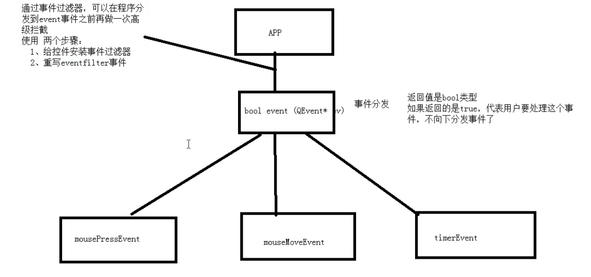
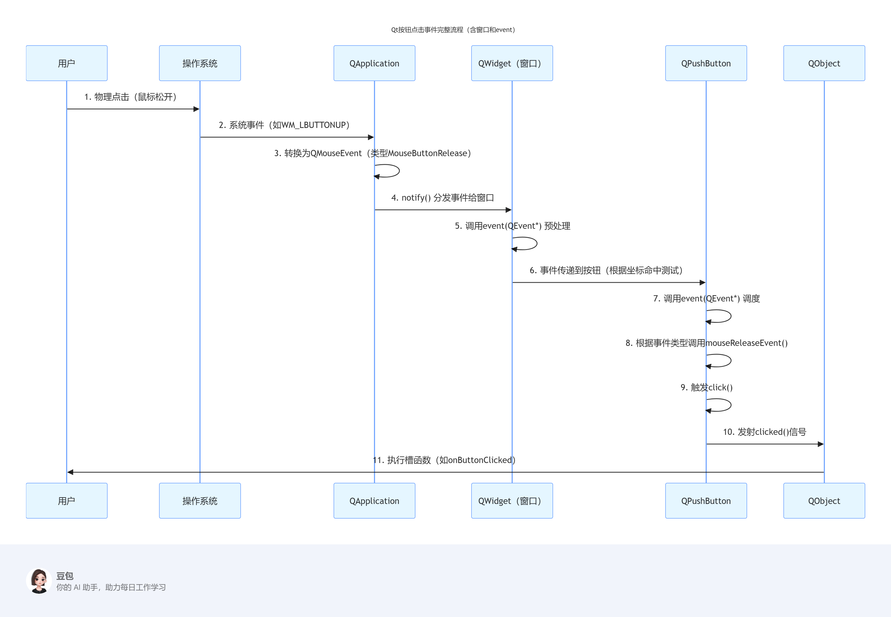

# Qt

## 1. 基础介绍

- Qt是一个跨平台的C++图形用户界面应用程序框架。它为应用程序开发者提供建立艺术级图形界面所需的所有功能。它是完全面向对象的，很容易扩展，并且允许真正的组件编程。
- 1991 奇趣科技
- MFC不是跨平台的

- 优势
	1. 跨平台，几乎支持所有的平台
	2. 接口简单，容易上手，学习QT框架对学习其他框架有参考意义。
	3. 一定程度上简化了内存回收机制
	4. 开发效率高，能够快速的构建应用程序。
	5. 有很好的社区氛围，市场份额在缓慢上升。
	6. 可以进行嵌入式开发。

- 成功案例
	1. Linux桌面环境KDE
	2. WPS Office 办公软件
	3. Skype 网络电话
	4. Google Earth 谷歌地图
	5. VLC多媒体播放器
	6. VirtualBox虚拟机软件

## 2. 框架说明

### 2.1 窗口类

- 窗口共有3种基类
1. QWidget
2. QMainWindow
3. QDialog

> [!NOTE] 其实QWidget是父类。QMainWindow和QDialog均继承于QWidget。

- 自定义的窗口类继承于上述三大类，其中`Q_OBJECT`是一个宏，申明后表示该窗口类可以使用**信号和槽的机制**。

- main函数`main(int argc char *argv[])`是程序项目的入口，第二个参数是一个指针数组。main函数里实例化一个应用程序对象和窗口对象，将应用程序对象挂入消息循环机制，窗口对象进行显示。

- QApplication：包含一个应用程序类的头文件，在Qt中，应用程序对象有且仅有一个。
- `a.exec()`是让应用程序对象（有且仅有1个）进入消息循环机制中，让代码阻塞到当前行。
-

### 2.2 工程文件

- .pro文件
- Qt包含的模块
```
QT       += core gui
greaterThan(QT_MAJOR_VERSION, 4): QT += widgets
```

|模块|描述|
|:---:|:---|
|Qt Core|下面其他模块使用的核心基础类（Qt Core是非图形模块）。|
|Qt D-Bus|用于通过 D-Bus 协议进行进程间通信的类。|
|Qt GUI|图形用户界面 （GUI） 组件的基类。|
|Qt Network|使网络编程更轻松、更易移植的类。|
|Qt QML|QML 和 JavaScript 语言的类。|
|Qt Quick|一个声明性框架，用于构建具有自定义用户界面的高度动态的应用程序。|
|Qt Quick Controls|提供轻量级 QML 类，用于为桌面、嵌入式和移动设备创建高性能用户界面。这些类型采用简单的样式体系结构，并且非常高效。|
|Qt Quick Dialogs|用于从 Qt 快速应用程序创建系统对话框并与之交互的类。|
|Qt Quick Layouts|布局是用于在用户界面中排列基于 Qt Quick 2 的项目的项。|
|Qt Quick Test	QML|应用程序的单元测试框架，其中测试用例编写为 JavaScript 函数。|
|Qt Test|用于单元测试 Qt 应用程序和库的类。|
|Qt Widgets|使用C++ widget扩展Qt GUI的类。|

- 模板变量：告诉qmake为这个应用程序生成哪种makefile。下面是可供使用的选择：**TEMPLATE** = app

|类型|说明|
|:---:|:---|
|app|建立一个应用程序的makefile。这是默认值，所以如果模板没有被指定，这个将被使用。|
|lib|建立一个库的makefile。|
|vcapp|建立一个应用程序的VisualStudio项目文件。|
|vclib|建立一个库的VisualStudio项目文件。|
|subdirs|这是一个特殊的模板，它可以创建一个能够进入特定目录并且为一个项目文件生成makefile并且为它调用make的makefile。|

- 指定生成的应用程序名：**TARGET** = QtDemo

- 工程中包含的头文件/源文件/ui文件/资源文件：
```
SOURCES += \
    main.cpp \
    mywidget.cpp

HEADERS += \
    mywidget.h
```

- 配置信息：CONFIG用来告诉qmake关于应用程序的配置信息。

```
CONFIG += c++17
```

## 3. 对象树

- 控件的基类也是窗口类，需要严格指定各个窗口间的关系。
- QObject是以对象树的形式组织起来的。
- 当创建一个QObject对象时，QObject的构造函数接收一个QObject指针作为参数，这个参数就是 parent，也就是父对象指针，指向其父对象，创建的这个QObject对象会自动添加到其父对象的children()列表。当父对象析构的时候，这个列表中的所有对象也会被析构。（注意，这里的父对象并不是继承意义上的父类！）
- 当创建的对象在堆区时候，如果指定的父亲是QObject派生下来的类或者QObject子类派生下来的类，可以不用管理释放的操作，将对象会放入到对象树中。一定程度上简化了内存回收机制。



- QWidget是能够在屏幕上显示的一切组件的父类。QWidget继承自QObject，因此也继承了这种对象树关系。一个孩子自动地成为父组件的一个子组件。因此，它会显示在父组件的坐标系统中，被父组件的边界剪裁。例如，当用户关闭一个对话框的时候，应用程序将其删除，那么，我们希望属于这个对话框的按钮、图标等应该一起被删除。事实就是如此，因为这些都是对话框的子组件。我们也可以自己删除子对象，它们会自动从其父对象列表中删除。比如，当我们删除了一个工具栏时，其所在的主窗口会自动将该工具栏从其子对象列表中删除，并且自动调整屏幕显示。

- 当一个QObject对象在堆上创建的时候，Qt 会同时为其创建一个对象树。不过，对象树中对象的顺序是没有定义的。这意味着，销毁这些对象的顺序也是未定义的。任何对象树中的 QObject对象 delete 的时候，如果这个对象有 parent，则自动将其从 parent 的children() 列表中删除；如果有孩子，则自动 delete 每一个孩子。Qt 保证没有QObject会被 delete 两次，这是由析构顺序决定的。
- 如果QObject在栈上创建，Qt 保持同样的行为。正常情况下，这也不会发生什么问题。

> [!NOTE] 声明的变量名会依次存入一个栈中，当超出作用域的时候最后一个创建的对象会先被作为析构对象，析构时找其parent，在其parent的children()列表中移除该对象，接着对该对象的children()列表中的对象析构，最后析构该对象自身。至此该对象析构完成，接着弹出栈中下一个要被析构的对象，重复执行，这个栈只是记录变量名称的，相当于索引。

> [!NOTE] 非控件或窗口的类的对象也可以设置父对象，其也可以被Qt托管析构。

## 4. 窗口坐标体系

- 以左上角为原点（0,0），X向右增加，Y向下增加。
- 对于嵌套窗口，其坐标是相对于父窗口来说的。

## 5. 信号和槽

### 5.1 原理

- 信号槽是 Qt 框架引以为豪的机制之一。所谓信号槽，实际就是观察者模式。**当某个事件发生之后**，比如，按钮检测到自己被点击了一下，**它就会发出一个信号（signal）**。这种发出是没有目的的，类似广播。**如果有对象对这个信号感兴趣，它就会使用连接（connect）函数**，意思是，**将想要处理的信号和自己的一个函数（称为槽（slot））绑定来处理这个信号**。也就是说，**当信号发出时，被连接的槽函数会自动被回调**。这就类似观察者模式：当发生了感兴趣的事件，某一个操作就会被自动触发。
- 信号槽的优点：松散耦合。信号发送端和接收端本来是没有关联的，通过connect连接将两端耦合在了一起。

- connect()函数最常用的一般形式：connect(sender, signal, receiver, slot);
	1. sender：发出信号的对象
	2. signal：发送对象发出的信号
	3. receiver：接收信号的对象
	4. slot：接收对象在接收到信号之后所需要调用的函数（槽函数）

> [!NOTE] 控件或者是窗口对象可以有一些被触发的事件，触发这些事件就会发出相应的信号，大多数情况下事件和消息合并处理统一为消息；接收方监听到指定消息后执行相应的槽函数。

### 5.2 自定义信号和槽

- 自定义信号：
	1. 写到signals下
	2. 返回值只能是void
	3. 只需要声明，不需要实现
	4. 可以有参数，可以重载
	5. 发送者必须是QObject的子类

- 自定义槽函数
	1. 可以写到public下当作正常的函数（槽函数是普通的成员函数，作为成员函数，会受到 public、private、protected 的影响）
	2. 返回值只能是void
	3. 需要声明，也需要实现
	4. 可以有参数，可以重载
	5. 接收者如果是成员函数，那么其对应的类必须是QObject的子类
	6. 任何成员函数、static 函数、全局函数和 Lambda 表达式都可以作为槽函数

- 手动触发自定义信号
	1. 触发自定义信号要用 `emit`，eg. emit tea->hungry();

- 连接信号和槽
	1. 使用connect()函数连接信号和槽。
	2. 信号槽要求信号和槽的参数一致，所谓一致，是参数类型一致
	3. 如果信号和槽的参数不一致，允许的情况是，槽函数的参数可以比信号的少，即便如此，槽函数存在的那些参数的顺序也必须和信号的前面几个一致起来。这是因为，你可以在槽函数中选择忽略信号传来的数据（也就是槽函数的参数比信号的少）。
	4. 一个信号可以和多个槽相连，如果是这种情况，这些槽会一个接一个的被调用，但是它们的**调用顺序是不确定的**。
	5. 多个信号可以连接到一个槽**只要任意一个信号发出，这个槽就会被调用**。
	6. 一个信号可以连接到另外的一个信号，当第一个信号发出时，第二个信号被发出。除此之外，这种信号-信号的形式和信号-槽的形式没有什么区别。
- 信号和槽重载
	1. 信号和槽重载时，需要用函数指针指向确定的信号和槽。同时在connect函数中填写新的指针参数。
- 断开信号和槽
	1. 使用disconnect()函数断开信号和槽，参数和connect的一样。
	2. 槽可以被取消链接，这种情况并不经常出现，因为**当一个对象delete之后，Qt自动取消所有连接到这个对象上面的槽**。

> [!NOTE] 目标是希望发送者发出信号，监听者接收信号并执行相应的槽函数。期间也可以实现信号连接信号，槽函数内部再发起新的信号。本质是由于信号与槽都是函数，都能写入connect函数中。

### 5.3 Lambda表达式

- 使用Lambda表达式设置槽函数可以实现槽函数获取其他来源的数据做参数。

```C
//Lambda表达式(实现slot的参数比signal的参数多）
QPushButton * btn6 = new QPushButton("Lambda", this);
btn6->move(400,200);
connect(btn6, &QPushButton::clicked, [btn6](QString foodName="wy")
	{btn6->setText(foodName);}
);
```

### 5.4 总结

- 如果槽函数无需明确接收方对象，则可以省略接收方对象这个参数。所以在Lambda表达式中大多数情况下都可以省略第三个参数。



## 6. QMainWindow

### 6.1 简介

- QMainWindow是一个为用户提供主窗口程序的类，包含一个菜单栏（menu bar）、多个工具栏(tool bars)、多个锚接部件/浮动窗口(dock widgets)、一个状态栏(status bar)及一个中心部件(central widget)，是许多应用程序的基础，如文本编辑器，图片编辑器等。



### 6.2 常见栏目

- 菜单栏最多只能有1个，创建时不能new QMenuBar，要使用其约束的单例创建方法 MenuBar()。状态栏，中心部件同样最多只能有1个。
- 各控件均需要绑定到主窗口上。
- 菜单栏可以加子菜单栏，Action，分割线等
- 工具栏可以加Action，按钮等Widget子类控件。
- 状态栏可以加Label等Widget子类。
- 铆接部件本身就是Widget子类。

## 7. 资源文件

- Qt添加资源文件需要先创建资源板块，会生成xxx.qrc的资源文件板块，然后在该资源文件板块中添加资源文件并设置其前缀。
- 使用Qt资源
	1. “:+前缀名+文件名”
	2. 绝对路径
	3. 在UI界面中图形化选择
- 在代码中使用Action时用ui->xxxAction即可索引到。

## 8. 对话框

### 8.1 QMessageBox

- Qt已经封装好的对话框QMessageBox
	1. QMessageBox::critical（错误对话框）
	2. QMessageBox::information（消息对话框）
	3. QMessageBox::question（提问对话框）
	4. QMessageBox::warning（警告对话框）

> [!Note] QMessageBox类有静态成员函数，直接使用静态成员函数就可以创建对话框，创建的对话框都是模态对话框，并且自动show，无需再调用exec或者show

### 8.2 自定义对话框

- 自定义对话框：QDialog
	1. 模态对话框（dlg.exec();），有阻塞功能
		1. 可以创建在栈区
		2. 调用exec()函数实现阻塞
	2. 非模态对话框
		1. 需要建立在堆区保持住
		2. 设置属性为关闭即释放，否则可能存在内存泄漏
		3. 调用show()展示窗口

### 8.3 标准对话框

- Qt已经内置好的
	1. QColorDialog：选择颜色
	2. QFileDialog：选择文件
	3. QFontDialog：选择字体
	4. QInputDialog：允许用户输入一个值，并将其值返回
	5. QMessageBox：消息对话框
	6. QProgressDialog：显示操作过程

## 9. 控件及使用

### 9.1 布局

1. 利用容器组合控件（可省略，但是为了便于控制还是组合起来再布局更好）
2. 容器内垂直水平网格布局
3. 巧用弹簧

### 9.2 按钮

1. 普通按钮
2. 工具按钮（带icon）
3. 单项选择按钮
4. 多项选择按钮

### 9.3 复合控件

 1. 列表
 2. 树结构
 3. 表格

### 9.4 组合控件（容器）

1. 组盒子
2. 滚动区域
3. 折叠组
4. 标签组
5. 翻页（栈）组
6. 边框
7. 浮动窗口

### 9.5 输入控件

1. 下拉框
2. 字体下拉框
3. 单行输入框
4. 文本输入框（支持加粗倾斜字体颜色等设置）
5. 纯文本输入框（不支持加粗倾斜字体颜色等设置）
6. 加减器
7. 小数加减器
8. 时间选择框
9. 日期选择框
10. 水平/垂直滚动条
11. 进度条

### 9.6 显示控件

1. Label（也可以显示图片、动图）
2. 浏览器文本
3. 图像展示
4. 日历展示
5. 时刻展示
6. 进度展示

### 9.7 自定义控件

- 自定义控件时要选“从类设计图形”，则会生成相应的UI和C++类，类中可以提供一些对外的功能函数。
- 主窗口想要使用自定义控件（类），则新建目标控件的UI对象（通常为Widget）,接着将该对象提升为目标控件的类。

## 10. 事件

### 10.1 鼠标事件

- 事件：QEvent，有很多枚举值
- 鼠标事件是事件中常用的一类
- 当要对控件添加一些默认的（构造和析构）或者被动触发的事件函数时，需要自己重定义一个类（基类与控件的基类相同），然后将控件提升为新建的类，接着在自己新建的类中可以重写很多方法或添加新方法。
- 鼠标的信息都记录在了QMouseEvent类中。
- 鼠标进入指定范围：enterEvent()；鼠标离开指定范围：leaveEvent()；
- mousePressEvent()，mouseReleaseEvent()，mouseMoveEvent()
- 其中mouseMoveEvent函数是当鼠标被追踪时才会检测，例如可能是按键摁下才开始追踪。即默认追踪状态是false，要想时刻追踪移动，需要设置为true。this->setMouseTracking(true);

### 10.2 定时器

- 定时器的目标是：每隔多久发送一次某个信号
- 事件的方式
	1. 定时器本质是利用的事件，重写timerEvent(QTimerEvent \*event)函数，参数event自动已经读取到了消息机制中的所有事件和信号，其中每个计时器都有一个timeId唯一标识，event可以区分不同的计时器。
	2. 在构造函数中构造并启动定时器startTimer(1000)，时间单位是毫秒。返回值是int，可以作为该计时器的timeId。
- 类的方式
	1. QTimer是一个定时器的类，调用其对象实例timer的start(500)方法即可启动定时器，实现的效果是该对象实例每0.5s发送一个信号。
	2. 紧接着用connect对信号进行处理即可。
	3. 当有多个定时器的时候再创建新的QTimer对象即可。

### 10.3 Qt事件

- 事件主要分为两种：

1. 在与用户交互时发生。比如按下鼠标（_mousePressEvent_），敲击键盘（_keyPressEvent_）等。
2. 系统自动发生，比如计时器事件（_timerEvent_）等。

- 在发生事件时（比如说上面说的按下鼠标），就会产生一个_QEvent_对象（这里是_[QMouseEvent]，为_QEvent_的子类），这个_QEvent_对象会传给当前组件的_event_函数。如果当前组件没有安装**事件过滤器**，则会被_event_函数发放到相应的_xxxEvent_函数中（这里是_mousePressEvent_函数）。

- 当系统产生QEvent对象时，就会传入相应类的event函数并调用。函数的返回值是bool类型，返回值不同有不同的意义。

- 如果传入的事件已被识别并且处理，则需要返回 true，否则返回 false。如果返回值是 true，那么 Qt 会认为这个事件已经处理完毕，不会再将这个事件发送给其它对象，而是会继续处理事件队列中的下一事件。
- 这个函数`event()`不处理事件本身；根据交付的事件类型，它为该特定类型的事件调用具体的事件处理程序，并根据事件是被接受还是被忽略发送响应。

- Qt系统在处理事件时，有一种机制叫**事件传播机制**。也就是说，在子组件（比如说一个_QButton_）中发生的事件，调用了子组件的_event_函数之后，还会调用父组件（比如说_QWidget_）的_event_函数。_event_函数的返回值就用于控制这样的一个过程。

> [!NOTE] 应用程序接收到事件后并不是直接调用相应的执行函数，而是先将事件对象扔给event函数进行事件分发。这个event函数接收的参数是QEvent类型的对象，返回值是bool类型。如果返回true，则说明该分发器已经把这个事件处理了（**这里其实就可以人为的重写分发器函数实现拦截事件和直接处理事件**），如果是false，则说明没处理，得把参数这个对象转发给具体操作的事件处理程序并调用。

### 10.4 事件分发器

- 一般来说，我们定义的类继承常用的Widget或者Label类，重写event函数时写自己要监听的事件的逻辑，不关注的事件交给父类（常用的Widget或者Label类）的默认event事件处理，否则会导致自己定义的类只能监听自己想要的事件。
- e.type()可以判断是什么类型的事件
- Qt 程序需要在main()函数创建一个QApplication对象，然后调用它的exec()函数。这个函数就是开始 Qt 的事件循环。在执行exec()函数之后，程序将进入事件循环来监听应用程序的事件。当事件发生时，Qt 将创建一个事件对象。
- Qt 中所有事件类都继承于QEvent。在事件对象创建完毕后，Qt 将这个事件对象传递给QObject的event()函数。event()函数并不直接处理事件，而是按照事件对象的类型分派给特定的事件处理函数（event handler）。
- event()函数主要用于事件的分发。所以，如果你希望在事件分发之前做一些操作，就可以重写这个event()函数了。例如，我们希望在一个QWidget组件中监听 tab 键的按下，那么就可以继承QWidget，并重写它的event()函数，来达到这个目的。

- 

### 10.5 事件过滤器

- 在程序将事件分发到事件分类器前，利用过滤器做拦截。

- 某些应用场景下，需要拦截某个组件发生的事件，让这个事件不再向其他组件进行传播，这时候可以为这个组件或其父组件安装一个事件过滤器（_evenFilter_）。

- evenFilter函数有两个参数，一个为具体发生事件的组件，一个为发生的事件（产生的_QEvent_对象）。当事件是我们感兴趣的类型，可以就地进行处理，并令其不再转发给其他组件。函数的返回值也是bool类型，作用跟_even_函数类似，返回true为不再转发，false则让其继续被处理。

- 实际使用中，我们需要对QObject组件调用_installEvenFilter_函数，即为组件安装过滤器，才能使用事件过滤器这个机制。这样，该组件及其子组件的事件就会被监听。这个机制的好处在于不用像重写QEvent和xxxEvent函数一样需要继承Qt的内置类。

- 同事件分发器一样，不过滤的事件抛给父类处理

```C
//安装事件过滤器
ui->label_6->installEventFilter(this);
//重写过滤器事件
bool myMainWindow::eventFilter(QObject *watched, QEvent *event){...}
```

- 

## 11. 绘图

### 11.1 绘图事件

- 绘图事件其实是默认执行的，eventFilter没有过滤掉，event函数分发事件到paintEvent()并调用，只不过这个函数默认是空，所以相当于不绘图，要想绘图直接重写该函数即可。
- 过程
	1. 先初始化一个画家类QPainter painter(this);this指的是当前类的图形区域，即绘图设备。
	2. 设置画笔：QPen pen(QPen pen(QColor(255,0,0),3,Qt::DashLine);    painter.setPen(pen);
	3. 设置抗锯齿能力：painter.setRenderHint(QPainter::Antialiasing);
	4. 移动画家的位置：painter.translate(100,100);
	5. 保存和恢复画家的位置：painter.restore(); painter.restore();
	6. 设置画刷：QBrush brush(Qt::green, Qt::Dense4Pattern);    painter.setBrush(brush);
	7. 绘制图形：painter.drawLine，painter.drawEllipse，painter.drawRect
	8. 绘制字：painter.drawText
	9. 绘制资源图片：painter.drawPixmap(-90, 1,QPixmap(":/pic/Image/LuffyQ.png"));
- 
- Qt 的绘图系统实际上是，使用QPainter在QPainterDevice上进行绘制，它们之间使用QPaintEngine进行通讯（也就是翻译QPainter的指令）。

### 11.2 手动调用绘图事件

- 重新调用绘图事件，并不能直接显示的调用paintEvent函数，因为它需要参数，必须是事件触发的，而不是显示逻辑调用。
- 重新调用绘图事件，应该使用update()或者repaint()，该函数会重新调用paintEvent函数。

### 11.3 绘图设备

- 绘图设备是指继承QPaintDevice的子类。常用的是四个这样的类，分别是QPixmap、QBitmap、QImage和 QPicture。其中，
	1. QPixmap专门为图像在屏幕上的显示做了优化
	2. QBitmap是QPixmap的一个子类，它的色深限定为1，可以使用 QPixmap的isQBitmap()函数来确定这个QPixmap是不是一个QBitmap。
	3. QImage专门为图像的像素级访问做了优化。可以修改像素点img.setPixel(i,j,value)
	4. QPicture可以记录和重现QPainter的各条命令。用于记绘图指令。
- 绘图设备相当于一张纸，决定了画在哪个纸上，QWidget的父类是QObject and QPaintDevice。
- 可以新建一个QPixmap的绘图设备，在其上绘制后保存至本地。
- 可以在QWidget绘图设备上绘制QPixmap绘图设备，类似于纸叠纸

## 12. 文件

### 12.1 文件读写

- 文件读取对话框：QString path = QFileDialog::getOpenFileName(this,"打开文件","./");
- 读过程
	1. 创建文件对象：QFile file(path);
	2. 设置打开方式：file.open(QIODevice::ReadOnly);
	3. 读取内容：QByteArray array = file.readAll();，这里读到的是QByteArray；QByteArray array2; while(!file.atEnd()){array += file.readLine();}读的也是QByteArray
	4.  输出内容：注意编码格式转换
	5. 关闭文件对象：file.close();
- 写过程
	1. 创建文件对象：QFile file(path);
	2. 设置打开方式：file.open(QIODevice::Append);
	3. 写入内容：file.write("aaaaaaaaa");
	4. 关闭文件对象：file.close();

### 12.2 文件信息

- 文件信息类：QFileInfo
- 过程
	1. 创建文件信息对象：QFileInfo info(path);
	2. 获取其信息：info.size()<<info.suffix()<<info.fileName()<<info.filePath()<<info.birthTime()<<info.lastModified();，size输出的是字节的大小,data返回的是QDateTime。
	3. 输出内容：qDebug()<<info.birthTime().toString("yyyy/MMdd hh:mm:ss")<<info.lastModified();，注意格式转换

## 13. 核心类

### 13.1 基础数据类型

|**C++ 类型**|**Qt 对应类型**|**说明**|
|---|---|---|
|`bool`|`bool`|完全兼容，Qt 中无替代类型。|
|`char`|`char`|8 位字符，完全兼容。|
|`wchar_t`|通常使用 `QChar`|`QChar` 是 16 位 Unicode 字符，替代 `wchar_t` 处理国际化文本。|
|`int`/`long`|`int`/`qint32`/`qlonglong`|`qint32` 等类型保证跨平台长度一致（如 `qint64` 始终为 64 位）。|
|`float`/`double`|`float`/`double`|完全兼容，Qt 中无替代类型。|
|`void*`|`QVariant`|`QVariant` 是类型安全的通用容器，可存储多种数据类型（类似 `std::any`）。|

### 13.2 预处理与宏

|**C++ 特性**|**Qt 对应特性**|**说明**|
|---|---|---|
|`#define`|Qt 特定宏|Qt 使用宏实现信号槽、元对象系统（如 `Q_OBJECT`、`SIGNAL()`、`SLOT()`）。|
|`assert()`|`Q_ASSERT()`|Qt 的断言宏，支持调试模式下的条件检查。|
|`__FILE__`/`__LINE__`|`Q_FUNC_INFO`|`Q_FUNC_INFO` 提供函数名、文件名和行号信息。|

### 13.3 面向对象特性

|**C++ 特性**|**Qt 对应特性**|**说明**|
|---|---|---|
|继承与多态|Qt 类继承体系|Qt 类通常继承自 `QObject`，支持信号槽和元对象系统。|
|虚函数|正常使用|Qt 类可使用 C++ 虚函数机制，同时信号槽基于元对象系统实现动态绑定。|
|抽象类|正常使用|Qt 支持纯虚函数定义抽象接口。|

### 13.4 模板与泛型编程

|**C++ 特性**|**Qt 对应特性**|**说明**|
|---|---|---|
|模板类 / 函数|Qt 模板类|Qt 提供了大量模板类（如 `QVector<T>`、`QMap<K,V>`），用法与 STL 类似。|
|`std::function`|`std::function` 或 `QtConcurrent`|Qt 提供 `QtConcurrent` 处理异步任务，也可直接使用 C++11 的 `std::function`。|
|`lambda` 表达式|完全支持|Qt 5+ 支持 C++11 lambda，可用于信号槽连接（如 `connect(sender, &Sender::signal, [=](){...})`）。|

### 13.5 容器类

|**STL 类型**|**Qt 对应类**|**特点**|
|---|---|---|
|`std::vector<T>`|`QVector<T>`|动态数组，连续内存存储，性能优于 `QList`（但插入删除效率低）。|
|`std::deque<T>`|`QList<T>` 或 `QQueue<T>`|`QQueue` 是 `QList` 的子类，提供队列接口（`enqueue`/`dequeue`）。|
|`std::list<T>`|`QList<T>`|双向链表（Qt 5 及以前），Qt 6 起改为连续存储（类似 `QVector`）。|
|`std::stack<T>`|`QStack<T>`|栈结构，LIFO（后进先出），基于 `QVector` 实现。|
|`std::queue<T>`|`QQueue<T>`|队列结构，FIFO（先进先出），基于 `QList` 实现。|
|`std::set<T>`|`QSet<T>`|无序集合，基于哈希表实现，查找效率高（平均 O (1)）。|
|`std::map<K, V>`|`QMap<K, V>`|有序映射（按键排序），基于红黑树实现，插入 / 查找效率 O (log n)。|
|`std::unordered_map`|`QHash<K, V>`|无序映射，基于哈希表实现，查找效率更高（平均 O (1)）。|

- std::deque是一种动态数组与链表结合的混合数据结构,`deque`维护一个**中控器（通常是指针数组）**，它存储了所有块的地址。中控器本身是动态扩展的，当块数量超过中控器容量时，会重新分配更大的中控器。
- std::stack和std::queue默认底层容器是`std::deque`（双端队列）
- Qt中没有QDeque
- QStack是基于QVector实现
- QQueue是基于QList实现

### 13.6 字符串处理

|**STL 类型**|**Qt 对应类**|**特点**|
|---|---|---|
|`std::string`|`QString`|Unicode 字符串，支持国际化、正则表达式、编码转换（如 UTF-8/16）。|
|`std::wstring`|`QString`|`QString` 使用 16 位 Unicode 存储，兼容宽字符需求。|
|`std::stringstream`|`QStringBuilder`|高效字符串拼接（使用 `%` 操作符），或 `QString::arg()` 格式化。|
|`std::regex`|`QRegularExpression`|Qt 的正则表达式类，功能更强大，性能更优（基于 PCRE）。|

### 13.7 文件与 IO

|**STL 类型**|**Qt 对应类**|**特点**|
|---|---|---|
|`std::fstream`|`QFile` + `QTextStream`|文件读写，支持跨平台路径处理、权限控制、文本 / 二进制模式。|
|`std::cout`/`std::cin`|`QTextStream`|控制台输入输出，支持 Unicode 和更灵活的格式化。|
|`std::ifstream`|`QFile` + `QTextStream`|读取文件（文本模式）。|
|`std::ofstream`|`QFile` + `QTextStream`|写入文件（文本模式）。|
|文件路径处理|`QDir`/`QFileInfo`|Qt 提供跨平台的文件路径处理，自动处理不同操作系统的路径分隔符。|

### 13.8 智能指针

|**STL 类型**|**Qt 对应类**|**特点**|
|---|---|---|
|`std::unique_ptr<T>`|`QScopedPointer<T>`|独占所有权的智能指针，对象销毁时自动释放内存。|
|`std::shared_ptr<T>`|`QSharedPointer<T>`|共享所有权的智能指针，通过引用计数管理内存。|
|`std::weak_ptr<T>`|`QWeakPointer<T>`|弱引用，不控制对象生命周期，用于解决循环引用问题。|

### 13.9 日期与时间

|**STL 类型**|**Qt 对应类**|**特点**|
|---|---|---|
|`std::chrono`|`QDateTime`/`QTime`|日期时间处理，支持时区转换、格式化输出、计时器功能。|
|`std::time_t`|`QDateTime::toTime_t()`|与 Unix 时间戳互转。|

### 13.10 并发与多线程

|**C++ 特性**|**Qt 对应特性**|**说明**|
|---|---|---|
|`std::thread`|`QThread`|`QThread` 提供更高级的线程管理（如信号槽、事件循环）。|
|`std::mutex`|`QMutex`|`QMutex` 支持递归锁和超时机制，功能更丰富。|
|`std::condition_variable`|`QWaitCondition`|与 `QMutex` 配合使用，实现线程间同步。|
|`std::atomic`|`QAtomicInteger`|Qt 的原子操作类，提供平台无关的原子操作。|
|`std::future`|`QFuture`|`QFuture` 与 `QtConcurrent` 配合，处理异步计算结果。|

### 13.11 网络编程

|**STL 类型**|**Qt 对应类**|**特点**|
|---|---|---|
|`std::socket`|`QTcpSocket`/`QUdpSocket`|跨平台 TCP/UDP 通信，基于事件驱动，支持异步操作。|
|`std::url` (C++20)|`QUrl`|URL 解析与操作，支持编码转换、URL 参数处理。|
|原始 socket API|`QTcpSocket`/`QTcpServer`/`QUdpSocket`|Qt 提供高层封装，支持异步通信和事件驱动编程。|
|HTTP 客户端|`QNetworkAccessManager`|支持 HTTP/HTTPS 请求，处理 Cookie、SSL 等。|
|WebSocket|`QWebSocket`|Qt 5.3+ 提供的 WebSocket 协议实现。|

### 13.12 异常处理

|**C++ 特性**|**Qt 对应特性**|**说明**|
|---|---|---|
|`try/catch`|完全支持|Qt 代码可正常使用 C++ 异常处理机制，但 Qt 自身很少抛出异常（更倾向返回错误码）。|
|`std::exception`|完全支持|Qt 代码可抛出和捕获标准异常，或自定义异常类。|

### 13.13 内存管理

|**C++ 特性**|**Qt 对应特性**|**说明**|
|---|---|---|
|`new`/`delete`|正常使用|Qt 对象可手动管理内存，也可通过父对象自动管理（如 `QObject` 的父子关系）。|
|智能指针 (`std::unique_ptr`, `std::shared_ptr`)|`QScopedPointer`, `QSharedPointer`|Qt 提供类似智能指针，与 Qt 对象的生命周期管理更兼容。|
|对象树|Qt 特有机制|Qt 对象通过父子关系形成对象树，父对象销毁时自动销毁所有子对象。|

### 13.14 元编程与反射

|**C++ 特性**|**Qt 对应特性**|**说明**|
|---|---|---|
|编译时元编程 (模板元)|较少使用|Qt 主要通过元对象系统（而非模板元）实现运行时反射。|
|反射机制|Qt 元对象系统|通过 `Q_OBJECT` 宏和 `QMetaObject` 类，支持运行时类型信息、属性访问和信号槽。|
|RTTI (`typeid`, `dynamic_cast`)|正常使用|Qt 类可使用 C++ RTTI，但元对象系统提供更强大的类型信息。|

### 13.15 GUI 与用户界面

|**C++ 特性**|**Qt 对应特性**|**说明**|
|---|---|---|
|无（C++ 标准无 GUI）|Qt Widgets 或 Qt Quick|Qt Widgets 提供传统桌面控件，Qt Quick 基于 QML 实现现代 UI 设计。|
|事件循环|`QCoreApplication::exec()`|Qt 应用程序的核心，处理窗口事件、定时器等。|
|信号与回调|Qt 信号槽机制|比 C++ 回调函数更灵活，支持类型安全的跨线程通信。|

### 13.16 国际化与本地化

|**C++ 特性**|**Qt 对应特性**|**说明**|
|---|---|---|
|无标准方案|`QString` + `Qt Linguist`|`QString` 存储 Unicode 文本，`Qt Linguist` 工具生成翻译文件（.ts/.qm）。|
|字符串编码转换|`QTextCodec`|处理不同字符编码间的转换（如 UTF-8、GBK、Latin1 等）。|

## 14. 其他类

### 14.1 QProcess

`QProcess` 是 Qt 中管理外部进程的核心类，封装了进程启动、通信、终止等功能，常用方法如下：

|分类|方法|作用|
|---|---|---|
|**进程启动**|`start(const QString &program)`|启动指定程序（program 为可执行文件路径）|
||`startDetached(...)`|启动独立进程（与主进程脱离关联）|
|**数据发送**|`write(const QByteArray &data)`|向子进程的标准输入写入数据|
|**数据接收**|`readAllStandardOutput()`|读取子进程的标准输出数据|
||`readAllStandardError()`|读取子进程的错误输出数据|
|**进程控制**|`terminate()`|发送终止信号（温和终止，允许清理资源）|
||`kill()`|强制终止进程（立即结束，可能丢失数据）|
||`waitForFinished(int msecs)`|等待进程结束（超时时间 msecs，-1 为无限等）|
|**状态查询**|`isOpen()`|判断进程是否启动并处于运行状态|
||`state()`|返回进程状态（NotRunning/Starting/Running）|
|**信号**|`readyReadStandardOutput()`|子进程有标准输出时触发|
||`readyReadStandardError()`|子进程有错误输出时触发|
||`finished(int exitCode)`|子进程结束时触发|

### 14.2 动画

- QPropertyAnimation
```cpp
QPropertyAnimation *animation = new QPropertyAnimation( this,"geometry");
animation->setDuration(200);
animation->setStartValue(QRect(this->x(),this->y(),this->width(),this->height()));
animation->setEndValue(QRect(this->x(),this->y()+10,this->width(),this->height()));
animation->setEasingCurve(QEasingCurve::OutCurve);
animation->start();
```

### 14.3 音效

- QSound
- 需要包含新的模块multimedia
```C
QSoundEffect *startSound = new QSoundEffect(this);
startSound->setSource(QUrl::fromLocalFile(":/res/TapButtonSound.wav"));
startSound->play();
```
- 可以设置循环播放的次数，设为-1表示一直循环。

### 14.4 QTextEdit

|**特性**|**QTextEdit**|**QPlainTextEdit**|
|---|---|---|
|**设计定位**|富文本编辑器（支持 HTML 格式）|纯文本编辑器（高效处理大文本）|
|**性能**|较慢（处理复杂格式）|较快（专注纯文本，优化大文件性能）|
|**默认行为**|支持换行（Wrap）|默认不换行（需手动设置 `setLineWrapMode`）|
|**文本格式**|支持 HTML 标签（如 `<b>`, `<a>`）、表格、图片等|仅支持纯文本（无格式）|
|**适用场景**|文档编辑器、聊天窗口（需显示富文本）|代码编辑器、日志查看器（大文本、无格式需求）|
|**常用 API**|`setHtml()`, `insertHtml()`|`setPlainText()`, `appendPlainText()`|

### 14.5 QConcurrent

在 Qt 项目中，`#include <QtConcurrent/QtConcurrent>` 引入的是 **QtConcurrent 模块**，它提供了一组高级 API，用于简化**并行编程**（多线程任务），让开发者无需手动管理线程池和低级线程同步细节。

#### 14.5.1 QtConcurrent 模块的核心功能

QtConcurrent 模块提供了三种主要的并行编程模式：
1. `QtConcurrent::run()`

- 功能：在后台线程执行函数或成员函数，返回 `QFuture` 对象用于跟踪结果。
- 示例：
    ```cpp
    #include <QtConcurrent/QtConcurrent>
    
    // 普通函数
    int calculateSum(int a, int b) {
        return a + b;
    }
    
    // 在后台线程执行
    QFuture<int> future = QtConcurrent::run(calculateSum, 10, 20);
    
    // 获取结果（阻塞当前线程，直到完成）
    int result = future.result();
    ```
2. 并行算法

- 功能：对容器（如 `QList`、`QVector`）中的元素并行执行操作，包括：
    - `QtConcurrent::map()`：对每个元素应用函数。
    - `QtConcurrent::filter()`：筛选符合条件的元素。
    - `QtConcurrent::reduce()`：合并元素结果。
- 示例：
    ```cpp
    QList<int> numbers = {1, 2, 3, 4, 5};
    
    // 并行计算每个元素的平方
    QFuture<void> future = QtConcurrent::map(numbers, [](int& num) {
        num = num * num;
    });
    
    future.waitForFinished(); // 等待所有任务完成
    ```

3. `QtConcurrent::mappedReduced()`

- 功能：结合映射（map）和归约（reduce）操作，先并行处理元素，再合并结果。
- 示例：

    ```cpp
    QList<int> numbers = {1, 2, 3, 4, 5};
    
    // 并行计算总和
    QFuture<int> future = QtConcurrent::mappedReduced(
        numbers,
        [](int num) { return num * num; }, // 映射函数：计算平方
        [](int& result, int value) { result += value; }, // 归约函数：累加结果
        QtConcurrent::UnorderedReduce // 归约顺序无关
    );
    
    int sum = future.result(); // 获取最终总和
    ```

#### 14.5.2 QFuture 与 QFutureWatcher

- **`QFuture`**：表示异步操作的结果，提供查询状态（如 `isFinished()`）、获取结果（如 `result()`）等功能。
- **`QFutureWatcher`**：用于监视 `QFuture` 的进度，支持信号槽机制，适合与 UI 交互。
    ```cpp
    QFuture<int> future = QtConcurrent::run(...);
    QFutureWatcher<int>* watcher = new QFutureWatcher<int>(this);
    
    // 连接信号，任务完成时触发
    connect(watcher, &QFutureWatcher<int>::finished, this, &MyClass::handleFinished);
    
    watcher->setFuture(future); // 设置要监视的 future
    ```

#### 14.5.3 使用场景

QtConcurrent 适用于以下场景：

- **耗时操作**：如文件读写、网络请求、复杂计算，避免阻塞主线程（UI 线程）。
- **数据并行**：对大量数据进行并行处理（如图像 / 视频处理、科学计算）。
- **任务并行**：同时执行多个独立任务（如多文件压缩、多 API 调用）。

#### 14.5.4 与手动管理线程的对比

|**特性**|**QtConcurrent**|**手动管理线程（QThread）**|
|---|---|---|
|**复杂度**|低（高级 API，无需管理线程池）|高（需手动创建 / 销毁线程，处理同步）|
|**适用场景**|简单并行任务（如函数调用、容器处理）|复杂长时间任务（如持续网络监听）|
|**与 UI 交互**|友好（通过 `QFutureWatcher` 和信号槽）|需谨慎（避免直接在子线程操作 UI）|
|**资源控制**|自动管理线程池，优化资源使用|需手动调整线程数量，可能导致资源浪费|

## 15. 字符串转换

|类型|所属语言 / 库|编码方式|内存管理方式|特点与用途|
|---|---|---|---|---|
|C 风格字符串|C/C++|依赖系统（如 ASCII、GBK）|手动管理（`char*`）|以`\0`结尾的字符数组，用于与 C 库交互，低级别操作（如网络编程）。|
|`std::string`|C++ STL|依赖系统（通常与 C 风格一致）|自动管理|C++ 标准字符串，支持动态扩展，提供丰富 API（如`substr`、`find`），适合常规使用。|
|`std::wstring`|C++ STL|UTF-16（Windows）或 UTF-32（Linux）|自动管理|宽字符字符串，用于 Unicode 编码，解决多语言显示问题（如中文、日文）。|
|`CString`|MFC/ATL|多字节或 Unicode（取决于项目配置）|自动管理|MFC 框架的字符串类，主要用于 Windows 桌面应用开发，兼容 MFC 组件。|
|`QString`|Qt|Unicode（UTF-16 内部存储）|自动管理|Qt 框架的字符串类，跨平台支持，提供丰富的文本处理功能（如正则表达式、国际化）。|
|`QByteArray`|Qt|原始字节流（无编码限制）|自动管理|用于存储原始二进制数据或文本，适合网络通信、文件操作等场景。|

```cpp
// std::string → char*
std::string str = "Hello";
const char* c_str = str.c_str();        // 返回const char*，指向内部数据
char* non_const_str = &str[0];          // C++11及以后支持，需确保字符串非空

// char* → std::string
char* c_str = "World";
std::string str(c_str);                 // 直接构造


// 需要使用codecvt或Windows API（不同平台实现不同）
// 示例：Windows平台
#include <windows.h>

// std::string → std::wstring
std::wstring StringToWString(const std::string& str) {
    int len = MultiByteToWideChar(CP_UTF8, 0, str.c_str(), -1, NULL, 0);
    std::wstring wstr(len, 0);
    MultiByteToWideChar(CP_UTF8, 0, str.c_str(), -1, &wstr[0], len);
    return wstr;
}

// std::wstring → std::string
std::string WStringToString(const std::wstring& wstr) {
    int len = WideCharToMultiByte(CP_UTF8, 0, wstr.c_str(), -1, NULL, 0, NULL, NULL);
    std::string str(len, 0);
    WideCharToMultiByte(CP_UTF8, 0, wstr.c_str(), -1, &str[0], len, NULL, NULL);
    return str;
}

// QString ↔ std::string
QString qstr = QString::fromStdString(std_str);
std::string std_str = qstr.toStdString();

// QString ↔ std::wstring
QString qstr = QString::fromStdWString(wstr);
std::wstring wstr = qstr.toStdWString();

// QString ↔ char*
QString qstr = QString::fromUtf8(c_str);  // 从UTF-8编码的char*转换
const char* c_str = qstr.toUtf8().data(); // 转换为UTF-8编码的char*

// QString ↔ QByteArray
QString qstr = "文本";
QByteArray byteArray = qstr.toUtf8();      // 转换为UTF-8字节流
QString qstr2 = QString::fromUtf8(byteArray); // 从字节流恢复
QByteArray byteArray = qstr.toLocal8Bit(); //转换为本地编码（如 Windows 的 GBK）。
QString qstr3 = QString::fromLocal8Bit(byteArray); //从本地编码转换

// QByteArray ↔ char*
QByteArray byteArray("Hello");
const char* c_str = byteArray.data();      // 直接获取内部指针
QByteArray byteArray = QByteArray::fromRawData(c_str, size); // 从char*创建,size表示数据的字节数，而非字符串长度。`strlen(c_str)` 会在第一个 `\0` 处截断

// QByteArray ↔ std::string
std::string str = byteArray.toStdString();
QByteArray byteArray = QByteArray::fromStdString(str);

// CString ↔ std::string
CString cstr("Hello");
std::string std_str = CT2A(cstr);          // 需要包含 <atlconv.h>
CString cstr(std_str.c_str());

// CString ↔ std::wstring
CStringW cstr(L"World");
std::wstring wstr = cstr.GetBuffer();
CStringW cstr(wstr.c_str());
```

- `std::string::c_str()` 返回的指针仅在字符串对象有效时可用，不要保存该指针。
- `QByteArray::data()` 同理，避免在 `QByteArray` 销毁后使用其指针。
- `QByteArray` 可以存储任意字节（包括 `\0`），但 `QByteArray::data()` 返回的 C 风格字符串会在第一个 `\0` 处截断。
- 若需完整数据（含 `\0`），用 `QByteArray::constData()` 或 `QByteArray::size()`。

[[QT]QByteArray与char、int、float(及其数组)之间的互相转化_qbytearray转char数组-CSDN博客](https://blog.csdn.net/humanking7/article/details/80913474)

[Qt基础开发之QString与QByteArray详细用法与区别及QString QByteArray互转-CSDN博客](https://blog.csdn.net/delphigbg/article/details/128074322)

[QT char*,char[],QString,string互相转换-CSDN博客](https://blog.csdn.net/superrunner_wujin/article/details/103950512)

|数据类型|是否包含 `\0`|`size` 的值|示例|
|---|---|---|---|
|C 风格字符串|否|`strlen(c_str)`|`const char* s = "Hello";`  <br>`QByteArray::fromRawData(s, strlen(s));`|
|二进制数据|是（若 `\0` 是有效数据）|`sizeof(data)` 或手动指定字节数|`char data[] = { 'A', '\0', 'B' }`;<br>`QByteArray::fromRawData(data, 3);`|
|带 `\0` 的字符串|是|手动指定完整长度|`const char* s = "Hello\0World";`  <br>`QByteArray::fromRawData(s, 11);`|

## 16. Qt事件的更深理解

- Qt平台将系统产生的消息转变成Qt事件
1. Qt事件是一个QEvent（或子类）的对象。一个事件就是一个对象
2. 有时一个事件包含多个事件类型，比如鼠标事件又可.以分为鼠标按下、双击、和移动多种操作
3. 事件类型由QEvent类的枚举型QEvent::Type来表示，可由帮助文档进行查询
4. Qt事件用于描述程序内部或外部发生的对应动作（描述的是操作系统发生来的消息，一个系统消息对应着一个消息事件）
5. 任意QObject对象都具备时间处理的能力

## 17. GUI应用程序的事件处理流程

1. Qt事件产生后会立即被分发到QWidget对象（QObject的子类，如按键QPushButton对象等）
2. QWidget对象其内部会有一个event(QEVent*)函数被调用，进行事件处理
3. event()根据事件类型调用不同的事件处理函数（默认的子函数）
4. 在事件处理函数中发送Qt中预定义的信号
5. 调用信号关联的槽函数

- 举个例子说明


1. 用户用鼠标点击按钮（或通过其他输入设备模拟点击）。
2. 操作系统将 “点击事件” 封装为系统级消息（如 Windows 的 `WM_LBUTTONUP`），转发给正在运行的 Qt 应用程序（`QApplication`）。
3. `QApplication` 将系统级事件（如 `WM_LBUTTONUP`）转换为 Qt 框架的统一事件对象（`QEvent` 或其子类，如 `QMouseEvent`）。
4. `QApplication` 的事件循环通过 `notify()` 方法，将事件分发给窗口，这也是Qt事件分发的入口。
5. 窗口通过事件传播机制（即调用自身的`event`函数），确定这个事件要传递给目标控件（`QPushButton`）
6. 把事件传递给QPushButton。
7. `QPushButton`调用 `QPushButton::event(QEvent* e)`。`event()` 函数统一处理各类事件（鼠标、键盘、绘制等）。`event()` 会根据事件类型（如 `QEvent::MouseButtonRelease`），调用对应的具体事件处理函数（如 `mouseReleaseEvent()`）。
8. 在 `mouseReleaseEvent()` 中，Qt 内部逻辑会调用 `click()` 函数，标记按钮为 “被点击” 状态。
9. `click()` 不仅处理视觉反馈（如按钮按下动画），还会触发信号发射（`clicked()`）的逻辑。
10. `QPushButton` 继承自 `QObject`，通过 `clicked()` 信号通知所有关联的槽函数。
11. 与 `clicked()` 信号关联的槽函数（如 `onButtonClicked()`）被调用，执行用户的业务逻辑。

## 18. Qt事件处理的五个层次

1. 重写paintEvent()、mousePressEvent()等事件处理函数。这是最普通、最简单的形式，同时功能也最简单。
2. 重写event()函数。event()函数是所有对象的事件入口，QObject和QWidget中的实现，默认是把事件传递给特定的事件处理函数。
3. 在特定对象上面安装事件过滤器。该过滤器仅过滤该对象接收到的事件。
4. 在QCoreApplication::instance()上面安装事件过滤器。该过滤器将过滤所有对象的所有事件，因此和notify()函数一样强大，但是它更灵活，因为可以安装多个过滤器。全局的事件过滤器可以看到 disabled 组件上面发出的鼠标事件。全局过滤器有一个问题：只能用在主线程。
5. 重写QCoreApplication::notify()函数。这是最强大的，和全局事件过滤器一样提供完全控制，并且不受线程的限制。但是全局范围内只能有一个被使用（因为QCoreApplication是单例的）。

## 19. QObject三大职责

1. 内存管理
2. 内省(intropection)
3. 事件处理机制

## 20. 事件和信号对比

> [!NOTE] 先有事件（QEvent），再有信号（SIGNAL）

||事件（QEvent）|信号（SIGNAL）|
|:---:|:---:|:---:|
|与QObject的关系|由具体对象进行处理|由具体对象主动产生|
|对程序影响|改写事件处理函数可能导致程序行为发生改变|信号是否存在对应的槽函数不会改变程序行为|
|两者的联系|一般而言，信号在具体的事件处理函数中产生|

1. Qt中的事件和信号不同
2. 事件由QObject对象进行处理
3. 信号由QObject对象触发
4. 重写事件处理函数可能改变程序行为
5. 信号的触发不会对程序行为造成影响
6. 事件处理是在实际工程开发中应用非常普遍的

## 注意事项

- 控件穿透
- label设置图标文字动画都可以直接setMovie，setPixmap
- pressEvent和click的先后
- 切换widget时状态栏不切换
- button需要设置icon的大小，Label不需要设置pixmap的大小
- Qt动画顺序
- 在实现多线程C/S通信时，有一个bug卡了我好久——当有一个C端关闭时，S端会崩溃。我通过类QList和迭代器来存储、访问C端链接的socket，而我在deleteSocket中delete迭代器后还想要访问到它，导致了内存的异常访问，使程序崩溃了。所以把delete \*iter改成(\*iter)->deleteLater(); 既可以实现原来释放内存的作用，又不会使程序崩溃

```cpp
constexpr 
```
