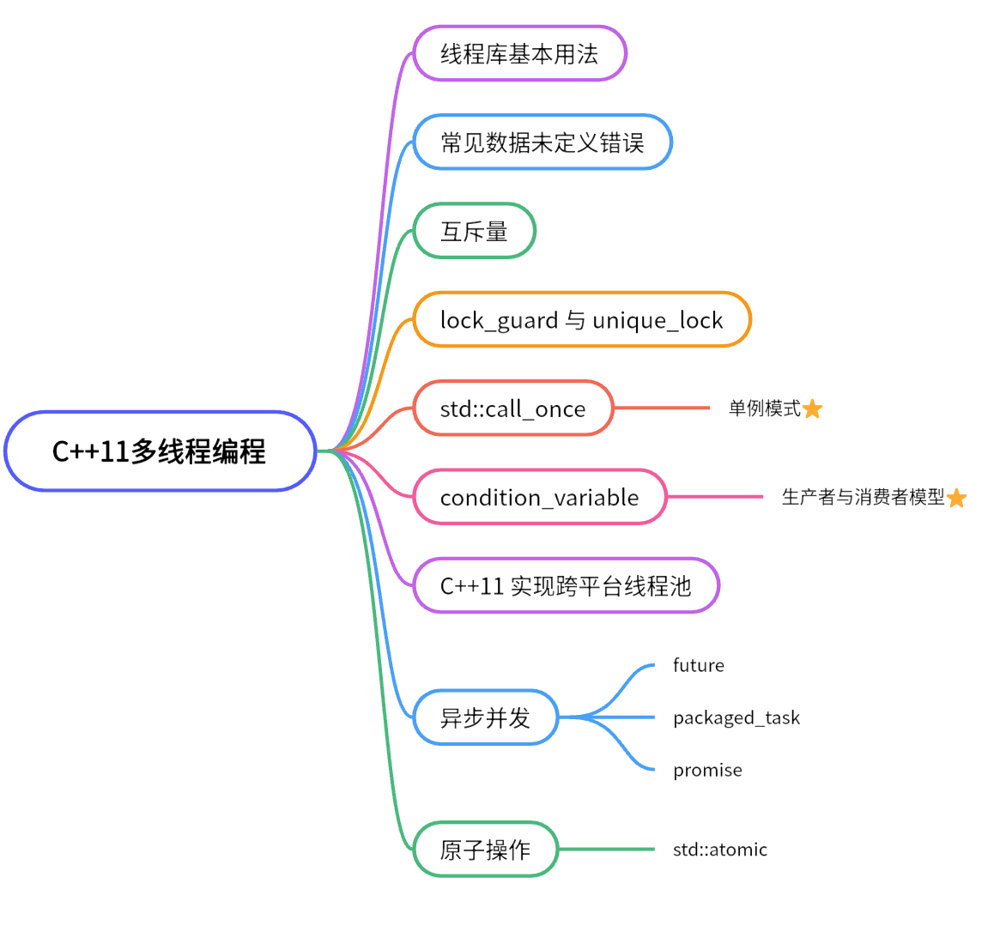
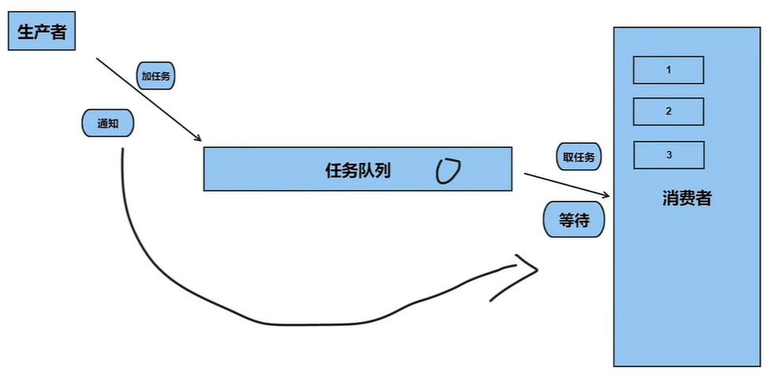
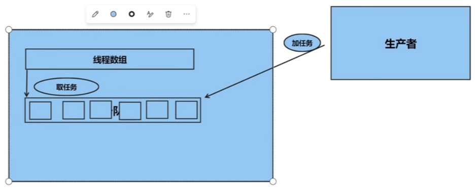

# Thead

## 1. 前言



## 2. 线程库

```C
//创建线程,调用的函数直接写名字也行，写地址也行
thread thread1(&printHello, "Hello thread1");
//join函数检查线程是否都全部结束,主线程会等所有线程结束后再往下执行主线程
thread1.join();

thread thread2(printHello, "Hello thread2");
//detach函数是将子线程分离主线程
thread2.detach();

thread thread3(printHello, "Hello thread3");
//joinable函数是判断当前线程能否调用join函数
bool isJoin = thread3.joinable();
if (isJoin) {
	thread3.join();
}
```

## 3. 线程带参数

- 值传递直接传入参数即可
- 引用传递（本质是指针常量）需要用`ref(arg)`。
- 线程执行类的成员函数，需要注意权限问题，private成员函数要用友元处理一下
- 当参数是基本数据类型时遵守上述传递规则即可。但是当参数是自定义的对象时，可能会出现线程还未执行完毕该对象已被销毁的情况，此时需要用智能指针保留参数对象的生命周期，直到线程结束。

## 4. 互斥量

- 在多个线程中共享数据时，需要注意线程安全问题。如果多个线程同时访问同一个变量，并且其中至少有一个线程对该变量进行了写操作，那么就会出现数据竞争问题。数据竞争可能会导致程序崩溃、产生未定义的结果，或者得到错误的结果。
- 为了避免数据竞争问题，需要使用同步机制来确保多个线程之间对共享数据的访问是安全的。常见的同步机制包括互斥量、条件变量、原子操作等。
- 互斥量（`mutex`）是一种用于实现多线程同步的机制，用于确保多个线程之间对共享资源的访问互斥。互斥量通常用于保护共享数据的访问，以避免多个线程同时访问同一个变量或者数据结构而导致的数据竞争问题。
- 互斥量提供了两个基本操作：`lock()` 和 `unlock()`。当一个线程调用 `lock()` 函数时，如果互斥量当前没有被其他线程占用，则该线程获得该互斥量的所有权，可以对共享资源进行访问。如果互斥量当前已经被其他线程占用，则调用 `lock()` 函数的线程会被阻塞，直到该互斥量被释放为止。

## 5. 互斥量死锁

- 假设有两个线程 T1 和 T2，它们需要对两个互斥量 mtx1 和 mtx2 进行访问，而且需要按照以下顺序获取互斥量的所有权：

	- T1 先获取 mtx1 的所有权，再获取 mtx2 的所有权。

	- T2 先获取 mtx2 的所有权，再获取 mtx1 的所有权。

- 如果两个线程同时执行，就会出现死锁问题。因为 T1 获取了 mtx1 的所有权，但是无法获取 mtx2 的所有权，而 T2 获取了 mtx2 的所有权，但是无法获取 mtx1 的所有权，两个线程互相等待对方释放互斥量，导致死锁。
- 修改上锁的顺序即可。

## 6. lock_guard 与 unique_lock

### 6.1 lock_guard

- `lock_guard` 是 C++ 标准库中的一种互斥量封装类，用于保护共享数据，防止多个线程同时访问同一资源而导致的数据竞争问题。

- `lock_guard` 的特点如下：

1. 当构造函数被调用时，该互斥量会被自动锁定。
2. 当析构函数被调用时，该互斥量会被自动解锁。
3. `lock_guard` 对象不能复制或移动，因此它只能在局部作用域中使用。

### 6.2 unique_lock

- `unique_lock` 是 C++ 标准库中提供的一个互斥量封装类，用于在多线程程序中对互斥量进行加锁和解锁操作。它的主要特点是可以对互斥量进行更加灵活的管理，包括延迟加锁、条件变量、超时等。

- `unique_lock` 提供了以下几个成员函数：

1. `lock()`：尝试对互斥量进行加锁操作，如果当前互斥量已经被其他线程持有，则当前线程会被阻塞，直到互斥量被成功加锁。
2. `try_lock()`：尝试对互斥量进行加锁操作，如果当前互斥量已经被其他线程持有，则函数立即返回 `false`，否则返回 `true`。
3. `try_lock_for(const chrono::duration<Rep, Period>& rel_time)`：尝试对互斥量进行加锁操作，如果当前互斥量已经被其他线程持有，则当前线程会被阻塞，直到互斥量被成功加锁，或者超过了指定的时间。
4. `try_lock_until(const chrono::time_point<Clock, Duration>& abs_time)`：尝试对互斥量进行加锁操作，如果当前互斥量已经被其他线程持有，则当前线程会被阻塞，直到互斥量被成功加锁，或者超过了指定的时间点。
5. `unlock()`：对互斥量进行解锁操作。

- 除了上述成员函数外，`unique_lock` 还提供了以下几个构造函数：
1. `unique_lock() noexcept = default`：默认构造函数，创建一个未关联任何互斥量的 `unique_lock` 对象。
2. `explicit unique_lock(mutex_type& m)`：构造函数，使用给定的互斥量 `m` 进行初始化，并对该互斥量进行加锁操作。
3. `unique_lock(mutex_type& m, defer_lock_t) noexcept`：构造函数，使用给定的互斥量 `m` 进行初始化，但不对该互斥量进行加锁操作。
4. `unique_lock(mutex_type& m, try_to_lock_t) noexcept`：构造函数，使用给定的互斥量 `m` 进行初始化，并尝试对该互斥量进行加锁操作。如果加锁失败，则创建的 `unique_lock` 对象不与任何互斥量关联。
5. `unique_lock(mutex_type& m, adopt_lock_t) noexcept`：构造函数，使用给定的互斥量 `m` 进行初始化，并假设该互斥量已经被当前线程成功加锁。

## 7. call_once

- 单例设计模式是一种常见的设计模式，用于确保某个类只能创建一个实例。由于单例实例是全局唯一的，因此在多线程环境中使用单例模式时，需要考虑线程安全的问题。
- 如果多个线程同时调用 `setData()` 函数来修改单例对象的数据成员 `m_data`，可能会导致数据不一致或不正确的结果。为了解决这些问题，我们可以使用 `call_once` 来实现一次性初始化，从而确保单例实例只会被创建一次。
-  once_flag的生命周期，它必须要比使用它的线程的生命周期要长。所以通常定义成全局变量比较好。

## 8. condition_variable



- `condition_variable` 的使用步骤：
1. 创建一个 `condition_variable` 对象。
2. 创建一个互斥锁 `mutex` 对象，用来保护共享资源的访问。
3. 在需要等待条件变量的地方使用 `unique_lock<mutex>` 对象锁定互斥锁并调用 `condition_variable::wait()`、`condition_variable::wait_for()` 或 `condition_variable::wait_until()` 函数等待条件变量。
4. 在其他线程中需要通知等待的线程时，调用 `condition_variable::notify_one()` 或 `condition_variable::notify_all()` 函数通知等待的线程。
- 使用 `condition_variable` 可以实现线程的等待和通知机制，从而在多线程环境中实现同步操作。在生产者-消费者模型中，使用 `condition_variable` 可以让消费者线程等待生产者线程生产数据后再进行消费，避免了数据丢失或者数据不一致的问题。

## 9. 跨平台线程池

- 定义一个 ThreadPool 类，并且在构造函数中创建了指定数目的线程。在每个线程中，不断地从任务队列中获取任务并执行，直到线程池被停止。在 enqueue() 函数中，我们将任务封装成一个 function 对象，并将它添加到任务队列中。在 ThreadPool 的析构函数中，等待所有线程执行完成后再停止所有线程。



## 10. 异步并发

### 10.1  async 、future

- 是C++11引入的一个函数模板，用于异步执行一个函数，并返回一个future对象，表示异步操作的结果。使用async可以方便地进行异步编程，避免了手动创建线程和管理线程的麻烦。
- 使用async函数异步执行了一个耗时的计算，这个计算可以在另一个线程中执行，不会阻塞主线程。它计算完成的结果会保存在`future`对象里，直到调用`future`对象的`.get()`则返回结果。

### 10.2 packaged_task

- packaged_task是一个类模板，用于将一个可调用对象（如函数、函数对象或Lambda表达式）封装成一个异步操作，并返回一个future对象，表示异步操作的结果。packaged_task可以方便地将一个函数或可调用对象转换成一个异步操作，供其他线程使用。
- 在封装成`packaged_task`时不会自动开启一个线程执行函数内容。需要自己手动创建线程去执行这个`packaged_task`，它的结果保存在`future`对象里，直到调用`future`对象的`.get()`则返回结果。

### 10.3 promise

- promise是一个类模板，用于在一个线程中产生一个值，并在另一个线程中获取这个值。promise通常与future和async一起使用，用于实现异步编程。

## 11. atomic

- `atomic` 是 C++11 标准库中的一个模板类，用于实现多线程环境下的原子操作。它提供了一种线程安全的方式来访问和修改共享变量，可以避免多线程环境中的数据竞争问题。
- `atomic` 的使用方式类似于普通的 C++ 变量，但是它的操作是原子性的。也就是说，在多线程环境下，多个线程同时对同一个 `atomic` 变量进行操作时，不会出现数据竞争问题。
- 原子操作的效率比用mutex的效率高。

- 以下是一些常用的 `atomic` 操作：
1. `load()`：将 `atomic` 变量的值加载到当前线程的本地缓存中，并返回这个值。
2. `store(val)`：将 `val` 的值存储到 `atomic` 变量中，并保证这个操作是原子性的。
3. `exchange(val)`：将 `val` 的值存储到 `atomic` 变量中，并返回原先的值。
4. `compare_exchange_weak(expected, val)` 和 `compare_exchange_strong(expected, val)`：比较 `atomic` 变量的值和 `expected` 的值是否相同，如果相同，则将 `val` 的值存储到 `atomic` 变量中，并返回 `true`；否则，将 `atomic` 变量的值存储到 `expected` 中，并返回 `false`。

## 注意事项
