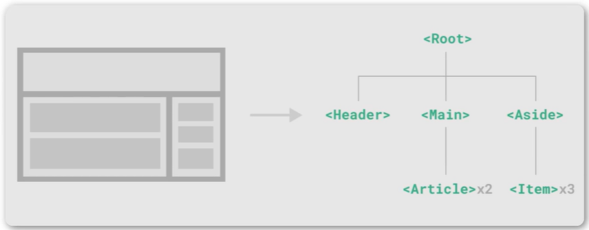
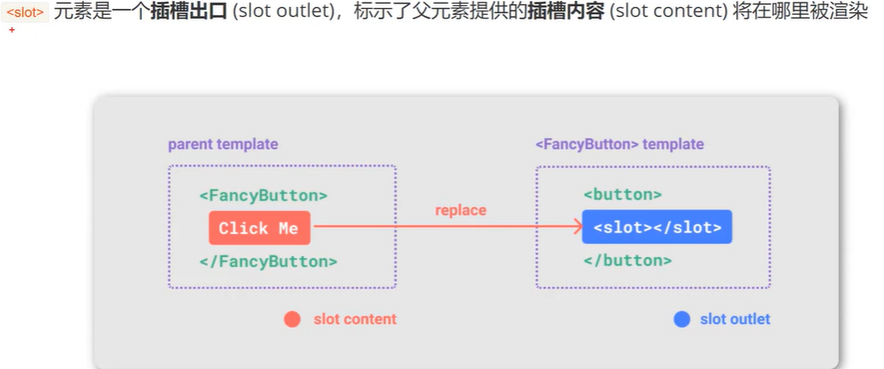
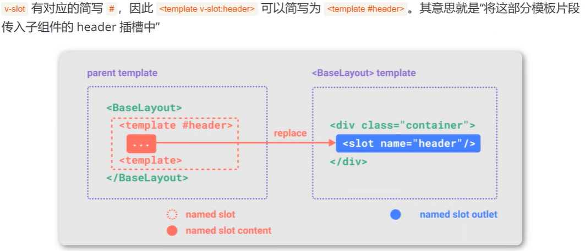
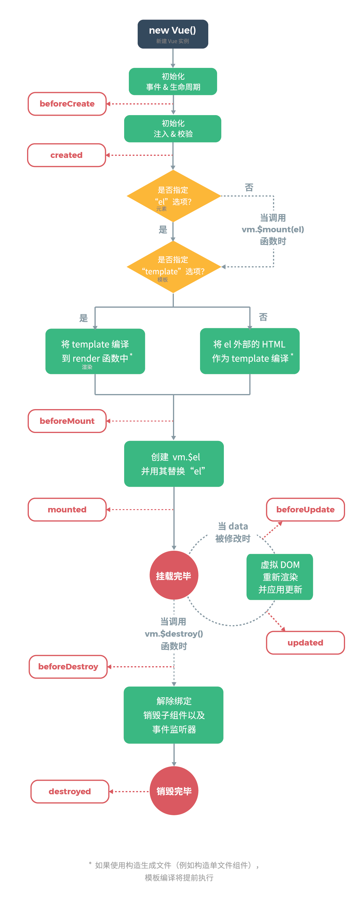
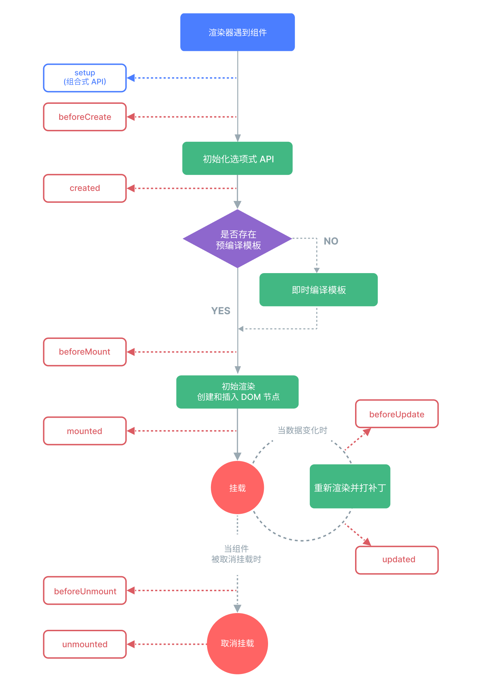
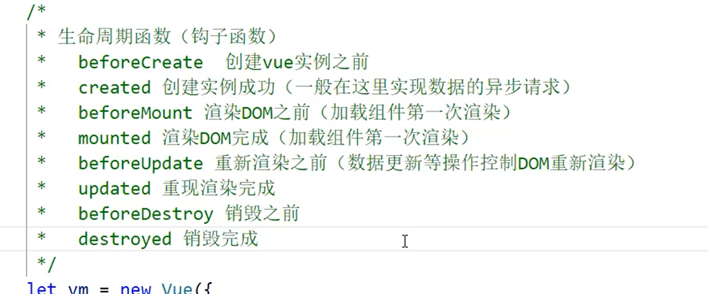
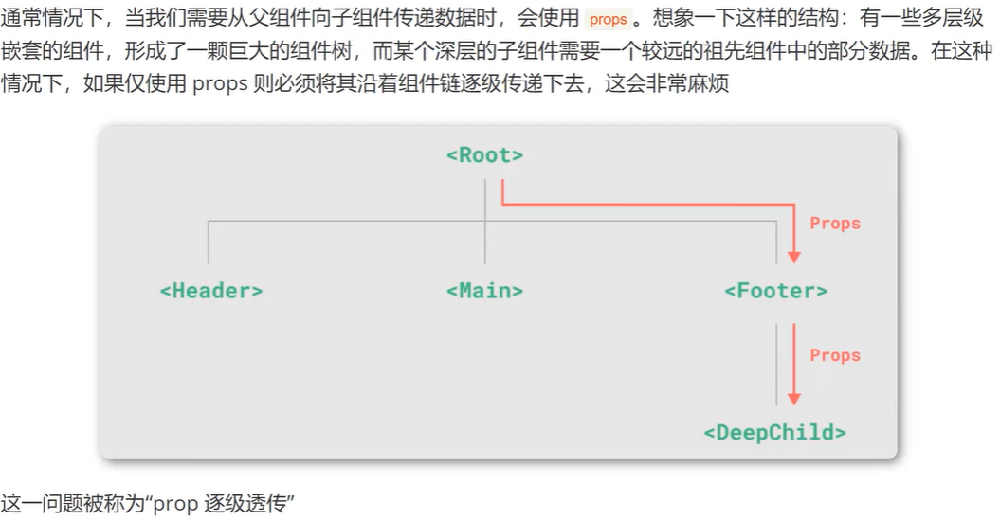
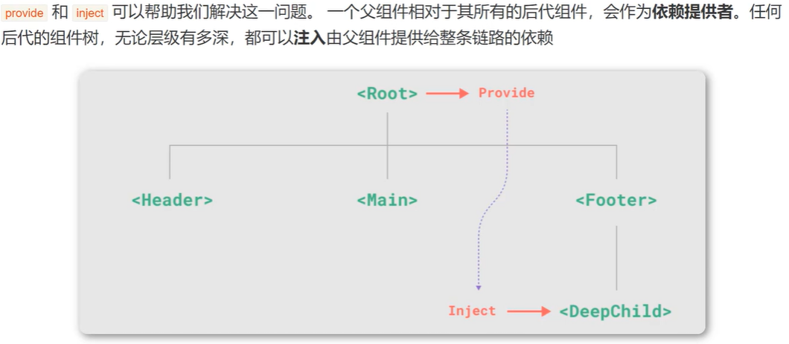
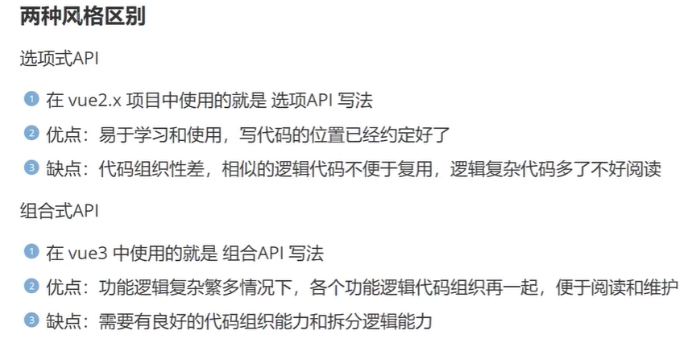
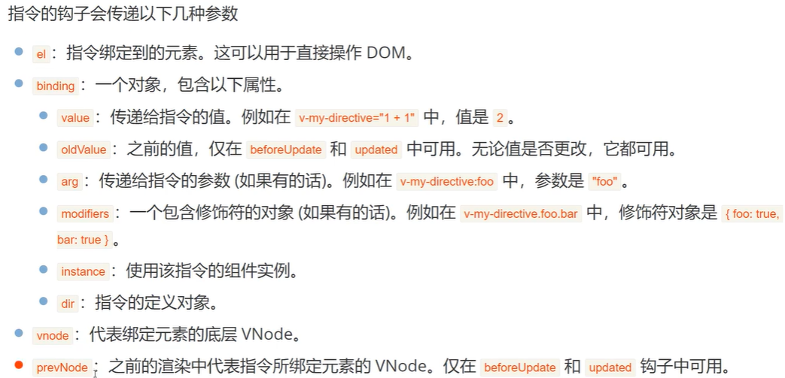

# 1. 简介

## 1.1 定义

- 用于构建用户界面的渐进式JavaScript框架
- 提供了一套声明式的、组件化的编程模型
- 渐进式框架
	- 无需构建步骤，渐进式增强静态的HTML
	- 在任何页面中作为Web Components嵌入
	- 单页应用（SPA）
	- 全栈/服务端渲染（SSR）
	- Jamstack/静态站点生成（SSG）
	- 开发桌面端、移动端、WebGL、甚至是命令行终端中的界面

## 1.2 Vue版本

- Vue2，组件风格为**选项式API**（Options API）
- Vue3，组件风格为**组合式API**（Composition API）
- [官网](https://cn.vuejs.org/)

## 1.3 Vue执行过程

- 每个Vue应用都是根据creatApp函数创建的一个新的应用实例。
- 在一个Vue项目中有且仅有一个一个Vue的实例对象
- 传入creatApp的对象实际上是一个组件，每个应用都需要一个==根组件==，其他组件将作为其==子组件==。
- 应用实例必须在调用了.mount()方法后才能渲染出来。这个方法接收一个容器参数，可以是一个实际的DOM元素或者是一个CSS选择器字符串。
- src目录下的assets文件夹存放公共资源，例如图片、公共CSS或者字体图标等。

# 2. 基础语法

## 2.1 命令行创建

创建项目：`npm init vue@latest`
执行项目：`cd 项目名`、`npm install`，`npm run dev`

## 2.2 模板语法

1. 文本插值
- 最基本的数据绑定形式是文本插值，它使用的是“Mustache”语法（双大括号）

2. 属性绑定
- 双大括号不能在HTML Attributes中使用。想要相应式地绑定Attribute，需要通过v-bind绑定。

## 2.3 渲染

1. 条件渲染

`v-if`,`v-else`,`v-else-if`,`v-show`

2. 列表渲染

`v-for`:不仅能遍历数组中每个元素（`(item,index) in results`），还可以遍历对象的所有属性（`(value,key,index) in results`）

> [!note] Vue按照“就地更新”的策略来更新通过`v-for`渲染的列表顺序。需要未每个元素对应的块提供一个唯一的key属性。

## 2.4 事件

1. 事件处理

使用`v-on`（简写为`@`）来监听DOM事件，并在事件触发时执行对应的JS。这个JS可以是函数的形式，也可以直接就是一段JS代码。

- 内联事件处理器
- 方法事件处理器

2. 事件参数

事件参数可以获取`event`对象和通过实践传递数据

3. 事件修饰符

Vue为`v-on`提供了事件修饰符，例如：`.stop`,`.prevent`,`.once`,`.enter`。

4. 数组变化侦测

- 变更数组:Vue能够侦听响应式数组的变更方法，并在它们被调用时出发相关的更新

`push()`,`pop()`,`shift()`,`unshift()`,`splice()`,`sort`,`reverse()`

- 替换整个数组:不更改原数组，总是返回个新数组

`filter()`,`concat()`,`slice()`

## 2.5 计算属性

- 模板中写太多逻辑会让模板变得臃肿，难以维护。推荐使用计算属性来描述依赖响应式状态的复杂逻辑。
- 将模板中需要计算的逻辑放到`computed`的计算属性里边。
- 在表达式中调用函数也可以得到和计算属性相同的结果。但是

> [!note] 计算属性：计算属性值会基于其响应式依赖被缓存。一个计算属性仅会在其响应式依赖更新时才重新计算。（这个属性值如果没有改变的情况下被多次调用时仅第一次执行运算）

> [!note] 方法：方法总是在重新渲染时发生函数执行运算。（这个属性值如果没有改变的情况下被多次调用时每次都要调用函数执行运算）

```JS
computed:{
	resultContent(){
		return this.result.content.length>0?"Yes":"No";
	}
}
```

# 3. 各种绑定

## 3.1 class绑定

- 数据绑定的常见需求是操纵元素的CSS class 列表，`class`是属性，可以用`v-bind`绑定。
- Vue为`class`的`v-bind`提供了特殊的功能增强，除了字符串外，表达式的值也可以是对象或数组。
- 如果数组和对象嵌套使用，那么只能是数组嵌套对象。不能对象嵌套数组

```HTML
<p :class="{'active':isActive}">class 样式绑定</p>
```

## 3.2 style绑定

- Vue为`style`的`v-bind`提供了特殊的功能增强，除了字符串外，表达式的值也可以是对象或数组。
- 一般不用数组，因为`style`样式本身就是一些键值对，而`class`是一个值，所以style数组中也是存放对象。

```HTML
 <p :style="{color:activeColor, fontSize:fontsize + 'px',}">style 对象绑定</p>
```

## 3.3 侦听器

- 侦听器是用来侦听数据的变化的
- 使用`watch`选项在每次响应式属性发生变化时触发一个函数。不是所有的数据都可以侦听，data返回的数据是可以侦听的。

```JS
watch:{
	//此处函数名必须和要监听的数据变量一致
	message(newValue, oldValue){
		console.log(newValue, oldValue);
	}
}
```

## 3.4 表单输入绑定

- 经常需要将表单输入框中的内容同步给JS中的变量。但是手动连接值绑定和更改事件监听器很麻烦。`v-model`指令可以简化这个过程的步骤。
- 为`v-model`提供了3个修饰符：`.lazy`,`.number`,`.trim`。
- 默认情况下，`v-model`会在每次input事件后更新数据，添加`.lazy`后改为每次在change事件后更新数据。

```HTML
<form>
	<input type="text" v-model="message2">
	<p>{{ message2 }}</p>
	<input type="checkbox" id="checkboxs" v-model="message3">
	<label for="checkboxs">{{message3}}</label>
	<input type="text" v-model.lazy="message4">
	<p>{{ message4 }}</p>
</form>
```

# 4. 模板引用

- Vue的声明性渲染模型抽象了大部分对DOM的直接操作，但在某些情况下仍然需要直接访问底层DOM元素。这时就需要使用`ref attribute`，挂在结束后引用都会被暴露在`this.$refs`上。

1. 内容改变：{{ 模板语法 }}
2. 属性改变：v-bind:指令
3. 事件：v-on:click

```JS
<p ref ="a" :class="classObject">{{ content }}</p>
console.log(this.$refs.a.innerHTML="hahaha")
```

# 5. 组件

## 5.1 组件组成

- Vue是组件式开发。
- 组件的最大优势就是可复用性
- 当使用构建步骤时，一般会将Vue组件定义在一个单独的`.vue`文件中，这被叫做单文件组件（SFC）
- 组件引用：采用ES6提供的import语句，具体步骤有3步如下：

1. 引入组件
2. 注入组件
3. 显示组件

## 5.2 组件嵌套关系



- 组件的注册方式

1. 局部注册
2. 全局注册：注册一次全局使用，需要写到`main.js`中。全局注册但是并没有被使用的组件无法在生产打包时自动移除（tree-shaking）。

## 5.3 组件传递数据（props）

```JS
// Parent.vue
<f06_comp title="Parent 数据" demo="测试" :msg="message"/>

// Child.vue
export default{
    props:["title","demo", "msg"]
}

// Child2.vue
export default{
    props:{
        age:{
            type:Number,
            default:0
        },
        demo:{
            type:[String, Number, Array, Object]
        },
        msg:{
            type:String
        }
        //数字和字符串可以直接default,数组和对象必须通过工厂函数返回默认值。
    }
}
```

- 通过`props`传递数据，不仅可以传递字符串类型的数据，还可以传递数字、对象、数组等类型的数据。

- props是只读的，无法修改父类的值，也就是说只能传参，不能有返回值。

- 通过传函数，能实现子传父。

```JS
//父
<f07_comp demo=20 :msg=message :names="names" :onEvent="dataFn"/>

dataFn(data){
	console.log(data)
	this.message2 = data
}
//子
<p>{{ onEvent("要传递的数据") }}</p>
```

## 5.4 组件事件（组件传递数据）

- 在组件的模板表达式中，可以直接使用`$emit`方法触发自定义事件
- 触发自定义事件的目的是组件之间的传递数据，实现了子类传父类的数据，也就是返回值。但是是通过事件触发的。
- 动态子传父可以用v-model结合watch侦察器实现。

> [!note] props:父传子

> [!note] 自定义事件：子传父

## 5.5 透传属性

- 传递给一个组件，通常直接传class,style,id
- 当一个组件以单个元素为根作渲染时（即==唯一根元素==），透传的属性会自动被添加到根元素上。
- 设置为false可以禁用透传属性    inheritAttrs:false,

## 5.6 插槽（slot）

- 组件能够接收任意类型的JS值作为props。如果要为子组件传一些模板片段，让子组件渲染这些片段，就要用到插槽。

- 

- 插槽内容可以访问到父组件的数据作用域，因为插槽内容本身是在父组件模板中定义的。

- 如果插槽没有传递任何内容，可以设置默认值

- 通过给模板添加具体的v-slot，实现具名插槽

- 

- 在某些情况下，插槽内容想要同时使用父组件和子组件的数据，可以向一个插槽的出口传递属性参数。

## 5.7 组件生命周期

- 从Vue组件被创建开始到其被卸载，这整个过程叫做该Vue组件的生命周期。
- 在此期间，Vue组件需要设置数据侦听，编译模板，挂载实例到DOM等。这些过程执行的那个相应的函数叫做生命周期钩子函数，这个函数无需调用，是自动执行的。





|  时期 |            函数            |
| :-: | :----------------------: |
| 创建期 |   beforeCreate, created  |
| 挂载期 |   beforeMount, mounted   |
| 更新期 |   beforeUpdate, updated  |
| 销毁期 | beforeUnmount, Unmounted |

```JS
    beforeCreate(){
        console.log("组件创建之前");
    },
    created(){
        console.log("组件创建之后");
    },
    beforeMount(){
        console.log("组件渲染之前");
    },
    mounted(){
        console.log("组件渲染之后");
    },
    beforeUpdate(){
        console.log("组件更新之前");
    },
    updated(){
        console.log("组件创建之后");
    },
    beforeUnmount(){
        console.log("组件销毁之前");
    },
    unmounted(){
        console.log("组件销毁之后");
    }
```

## 5.8 动态组件

- 多个组件动态切换显示.
- 当使用`<component is="">`在多个组件间切换时，被切换掉的组件会被卸载。可以通过`<keep-alive>`组件强制被切换掉的组件仍然保持存活状态。

```JS
//不保持组件存活
<component :is="tabComponent"></component>
<button @click="changeHandle">切换组件</button>
changeHandle(){
	this.tabComponent=this.tabComponent=="f10_comp"?"f11_comp":"f10_comp";
}
//保持组件存活
<keep-alive>
	<component :is="tabComponent"></component>
</keep-alive>
```

## 5.9 异步组件

- 在大型项目中，很多模块独立运行，为了优化组件性能，需要使用异步组件，即用到哪个再加载哪个。

```JS
import { defineAsyncComponent } from 'vue';
import f10_comp from './f10_comp.vue';
// import f11_comp from './f11_comp.vue';
// 异步加载组件
const f11_comp = defineAsyncComponent(()=>import("./f11_comp.vue"))
```

## 5.10 依赖注入

- 
- 
- provide和inject只能由上到下的传递。

```JS
//父
provide:{
	message:"f09的数据",
},
//子
inject:["message"],
```

# 6 组合式API

## 6.1 选项式和组合式对比

- 选项式API使用包含多个选项的对象来描述组件的逻辑，例如`data`，`methods`,`mounted`等。选项所定义的属性都会暴露在函数内部的this上，它会指向当前的组件实例。
- 
- vue3 的组合式API每次使用时需要引用相应的配件函数功能等，优势是在打包时只把使用的功能打包。

## 6.2 响应式API

- 组合式中没有data选项。变量的初始化依赖于ref和reactive。
- >[!note] ref用于创建基本类型响应数据（String Number Boolean）// 在JS读取时必须通过.value才能读取到值
- >[!note] reactive用于创建引用类型响应数据（Array Object）

```JS
import{ref} from 'vue'
const count = ref(0)
const userInfo = reactive({
    name:"iewn",
})
function increment(){
    count.value++;
}
```

## 6.3 计算属性

- 使用选项式API的时候，所有的计算属性都必须放在`computed`中，这样如果又很多计算属性就会很复杂且臃肿，组合式API会简洁很多。
```JS
const message = ref("ABC")
//计算属性
// 在JS读取时必须通过.value才能读取到值
const myreverse = computed(()=>{
    return message.value.split("").reverse().join("")
})
```

## 6.4 事件处理

- 组合式API中事件处理与原生JS很相似
```JS
<button @click="increment($event)">Count={{ count }}</button>
function increment(e){
    console.log("count++")
    count.value++;
}
```

## 6.5 侦听器

- 使用选项式API的时候，所有的侦听器都必须放在`watch`中，这样如果又很多侦听器就会很复杂且臃肿，组合式API会简洁很多。
```JS
//侦听器
watch(count,(NewValue,OldValue)=>{
    console.log(NewValue,OldValue);
})
```

## 6.6 生命周期

- 选项式写法只能存在一个mounted，写多个时会后者覆盖前者。
- 组合式写法可以写多个mounted。其他生命函数钩子函数类似。(导入是==on==Mounted)
```JS
import{onMounted} from 'vue'
//生命周期
onMounted(()=>{
    console.log("Initial count is " + count.value)
})
```

## 6.7 模板引用

- 本质上声明一个ref来存放该元素的引用，必须和模板里的ref同名

```JS
//这个不能放在函数里
const countNumber = ref(null);
onMounted(()=>{
    console.log("Initial count is "+ count.value);
    console.log("Initial count is "+ countNumber.value.innerHTML);
})
```

## 6.7 组件传参（props）

- 组合式引用子模板只需导入后就可以使用，无需注入。

```JS
//props
const props = defineProps({
    title:{
        type:String,
        default:""
    }
})
console.log(props)
console.log(props.title)
```

## 6.8 组件事件

- 需要先定义一个emit把所有组件事件的句柄都初始化好，然后在函数里选择用哪个句柄发送组件间的哪个事件。类似于6.6节。

```JS
const emit = defineEmits(["eventf14",])
//组件事件
function increment(e){
    console.log("count++")
    count.value++;
    emit("eventf14", [this.count, this.message])
}
```

# 7. 自定义指令

## 7.1 局部自定义指令

- 除了Vue内置的指令（例如`v-model`，`v-show`）等，Vue还允许自己定义的指令（Custom Directives）

1. 选项式API
```JS
<p v-author>西游记</p>
//自定义指令
    directives:{
        author:{
            mounted(element){
                console.log(element);
                element.innerHTML = element.innerHTML + "-wy撰写";
            }
        }
    }
```

2. 组合式API
```JS
<p v-author>西游记</p>
//自定义指令
const vAuthor = {
    mounted:(element)=>{
        console.log(element);
        element.innerHTML = element.innerHTML + "-wy撰写";
    }
}
```

## 7.2 全局自定义指令

- 自定义指令可以分为全局自定义指令和局部自定义指令。在全局注册则可以在任意组件中使用；局部注册只能在当前组件中使用。
- 7.1中两种都是局部自定义指令，全局自定义指令写在`main.js`中。
```JS
const app = createApp(App);
//在挂载前写全局注册的组件
app.component("f04_component", f04_component);
//在挂载前写全局自定义指令
app.directive("red",{
    mounted(element){
        element.style.color = 'red';
    }
})
app.mount('#app');
```

## 7.3 自定义指令钩子函数

- 自定义指令有很多钩子函数，可以理解为是自定义指令的生命周期函数，在不同情况下会自动调用。
- 同组件的生命周期函数相比，少了一个beforecreate。
- 
```JS
const vBlue = {
	//在绑定元素的attribute前
	//或事件监听器应用前调用
	created(el, binding, vnode, prevVnode){
		console.log("created");
	},
	
	//在元素被插入到DOM前调用
	beforeMount(el, binding, vnode, prevVnode){
		console.log("beforeMount");
	},
	
	//在绑定元素的父组件
	//以及它自己的所有子节点都挂载完成后调用
	mounted(el, binding, vnode, prevVnode){
		console.log(el);
        console.log(binding);
        console.log(vnode);
        console.log(prevVnode);
        el.style.color = 'blue';
		console.log("mounted");
	},
	
	//绑定元素的父组件更新前调用
	beforeUpdate(el, binding, vnode, prevVnode){
		console.log("beforeUpdate");
	},
	
	//在绑定元素的父组件
	//以及它自己的所有子节点都更新后调用
	updated(el, binding, vnode, prevVnode){
		console.log("updated");
	},
	
	//绑定元素的父组件卸载前调用
	beforeUnmount(el, binding, vnode, prevVnode){
		console.log("beforeUnmount");
	},
	
	//绑定元素的父组件卸载后调用
	unmounted(el, binding, vnode, prevVnode){
		console.log("unmounted");
	},
}
```
